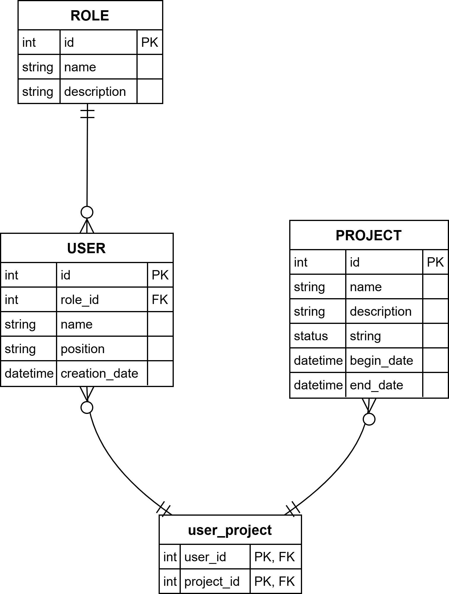

# Project Management API

API backend desarrollada con **FastAPI** para la gestión de proyectos de desarrollo de software.

## Descripción

Este servicio proporciona endpoints RESTful para realizar operaciones CRUD (Crear, Leer, Actualizar, Eliminar) sobre las entidades principales de un sistema de gestión de proyectos.

## Tecnologías Principales

*   **Python 3.x**
*   **FastAPI**: Framework web asíncrono de alto rendimiento.
*   **Uvicorn/Gunicorn**: Servidor ASGI.
*   **Docker & Docker Compose**: Para contenerización y orquestación local.
*   **Base de Datos**: PostgreSQL

## Instrucciones de ejecución de los contenedores

1. Crear un archivo .env dentro de app/, con las siguientes variables:
```bash
POSTGRES_USER=postgres
POSTGRES_PASSWORD=postgres
POSTGRES_SERVER=db
POSTGRES_PORT=5432
POSTGRES_DB=project_db
```
2. Construir la imagen a partir del Dockerfile
```bash
docker compose build
```
3. Levantar la aplicación con docker-compose:
```bash
docker compose up -d
```
3. Acceder a la API
La API estará disponible en `http://localhost:8000`.

5. Dar de baja la aplicación, conservando el volumen (se mantendrán los datos almacenados en la DB):
```bash
docker compose down
```
Dar de baja la aplicación, removiendo el volumen (se perderán los datos almacenados en la DB):
```bash
docker compose down -v
```

## Documentación Interactiva (Swagger UI / ReDoc)

Una vez que la API esté corriendo, puedes acceder a la documentación interactiva generada automáticamente por FastAPI:

*   **Swagger UI:** [http://localhost:8000/docs](http://localhost:8000/docs)
*   **ReDoc:** [http://localhost:8000/redoc](http://localhost:8000/redoc)

Aquí podrás ver todos los endpoints disponibles, sus parámetros y probarlos directamente desde el navegador.

## Endpoints Principales

*   `/projects/...`: Endpoints para la gestión de proyectos.
*   `/users/...`: Endpoints para la gestión de usuarios.
*   `/roles/...`: Endpoints para la gestión de roles.
*   `/info`: Información básica de la API.
*   `/healthcheck`: Endpoint de estado de salud.

Diagrama Entidad Relación

